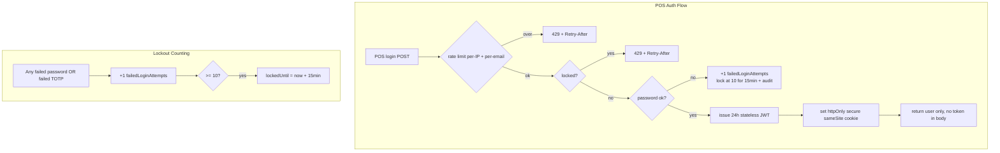

# Security Hardening and SEO/AEO Foundations — Implementation Plan

## Overview

Implements Phase 1 (security hardening across storefront, admin, and POS; R1–R6) and Phase 4 (SEO/AEO visibility; R21–R25) of the scale/security/RBAC foundations program, at zero budget on the current Vercel Hobby + Neon free stack. This plan fixes the live, exploitable gaps found in the audit — failed 2FA bypassing lockout, POS login with no rate limit/lockout and a token in localStorage, security headers not from a single source of truth — and fixes discoverability gaps: blog pages invisible to search engines, cart/checkout wrongly indexed, no OG images or canonicals, no AI-crawler policy or `llms.txt`. Phase 2 (sessions + RBAC) and Phase 3 (scale foundations) are deferred to their own plans.

## Problem Frame

The platform is live and multi-tenant. Today's real gaps, confirmed by code-level research:

- **Failed 2FA codes do not increment `failedLoginAttempts`**, and the counter resets before the 2FA step — a brute-forcer can hammer TOTP codes with no lockout (OWASP lists OTP guessing as a lockout-defeated attack). **Customer 2FA is not enforced at all on the live stack**: `/api/auth/login` never checks `user.totpEnabled` (it issues the session cookie directly), the Google 2FA completion path is broken (`/api/auth/google` returns `totpRequired` but issues no temp token), and the only TOTP-enforcing login lives in the dead `/api/customer/auth/*` duplicate.
- **POS login (`/api/pos/auth`) has no rate limit, no lockout, no 2FA**, and returns a stateless 24h JWT in the response body that the client persists to localStorage (`gg_pos_auth`) — an XSS-stealable credential, with an effectively unlimited login surface.
- **Customer auth has two stacks**: `/api/auth/*` (used by the storefront, has lockout) and `/api/customer/auth/*` (no lockout — an exposed duplicate brute-force surface).
- **Security headers are being changed in uncommitted local work** with two competing sources (middleware vs `next.config`), and the uncommitted CSP widened `img-src` to `https:` and still carries `'unsafe-inline' 'unsafe-eval'`.
- **SEO/AEO**: blog listing and post pages have no metadata at all; the sitemap includes cart/checkout/login/recently-viewed (transactional pages that should be noindex) and omits blog posts and images; there are no canonical tags anywhere, no OG/Twitter image files, no `llms.txt`, and robots.txt has no AI-crawler policy; product JSON-LD hardcodes `priceCurrency: "EGP"`.
- **Zero test files exist** (Vitest and Playwright are configured), so none of this is currently verifiable by machine.

## Requirements Trace

- R1. Every auth endpoint (admin login, admin 2FA, customer login, customer 2FA, POS login) is rate-limited in production; unconfigured = loud fail-open, configured-but-erroring = 429 fail-closed (U1)
- R2. Auth tokens live in httpOnly/secure/sameSite cookies; localStorage holds no credentials anywhere (U3)
- R3. Page-level security headers (CSP, HSTS, X-Frame-Options, Referrer-Policy, Permissions-Policy) from a single source of truth across storefront, admin, POS (U5)
- R4. Lockout + failed-attempt audit on every login surface, failed 2FA counting toward lockout (U2)
- R5. 2FA for privileged roles with enrollment (QR/secret), single-use backup codes, and recovery; force-enrollment for privileged admins (U4)
- R6. Security audit pass: CSRF coverage, authz on admin/POS APIs, secrets validated at boot, CSP tightened (U6)
- R21. Sitemap/robots/canonical hygiene: blog included, transactional pages noindex and out of the sitemap, canonical on canonically-reachable pages (U7)
- R22. Unique metadata per page, OG/Twitter cards with absolute 1200×630 images, valid JSON-LD (Product/Offer, BreadcrumbList, Organization, WebSite) (U8)
- R23. AEO: `llms.txt`, explicit AI-crawler policy, semantic crawlable HTML, AI-agent-completable browse → product → cart → checkout (U9)
- R24. Content-registry pattern for 50–500 unique product/category/blog pages (U10)
- R25. Measurement: Search Console verification + sitemap submission, AI-citation checks, quarterly audit (U10)

## Scope Boundaries

- Phase 2 (multi-device sessions R7–R10, POS session records R11, RBAC R12–R15) — separate plan; POS revocation explicitly deferred to it (user-confirmed split)
- Phase 3 (read caching R16, pooling R17, observability R18, order write path R19, scale checklist R20) — separate plan
- Paid infrastructure (Upstash paid, Neon paid, Vercel Pro) — not purchased here; the R20 checklist (Phase 3 plan) documents flips
- Customer-facing 2FA as a default requirement — out of scope per origin doc; privileged-admin 2FA (R5) only
- One additive Prisma migration — `Branch.failedLoginAttempts`/`lockedUntil`/`tokenVersion` and a `BackupCode` model (deepening correction: POS auth authenticates against `Branch`, which has no lockout fields, and no backup-code persistence exists anywhere; lockout/2FA fields exist only on Admin and User). Migration is additive columns/model only — no backfill, no destructive steps; it is a dependency of U2 and U4

### Deferred to Separate Tasks

- Customer 2FA backup codes / recovery parity: customer 2FA exists (setup/verify/disable) but lacks backup codes — extend in the Phase 2 plan's session work or a follow-up; noted, not built here
- Vercel WAF rate-limit rule (free on Hobby, 1M req/mo, IP-level): evaluated as a complement to Upstash per-account keys — decision deferred to Phase 3 scale work where IP-level controls are sized
- Nonce-based strict CSP: research shows it requires dynamic rendering and kills ISR/static caching planned in Phase 3 — rejected now, revisit when Phase 3 caching lands (see Key Technical Decisions)
- `typescript.ignoreBuildErrors: true` in `next.config.ts` with the pre-existing `@huggingface/transformers` import error in `prisma/seed-graph.ts` — resolved or documented as a dated exception as part of U6
- Hardcoded `priceCurrency: "EGP"` in product JSON-LD — multi-store currency handling is a store-config concern; fix pragmatically in U8 (store-driven where available), full multi-currency is out of scope

## Context & Research

### Relevant Code and Patterns

- Rate limiting: `src/lib/rate-limit.ts` — Upstash sliding window, `withRateLimit(handler, {limit, window, identifier, failClosed})`; unconfigured → `logger.warn` + pass-through, erroring → 429. R1's semantics already match; missing on `/api/pos/auth`
- Admin auth: `src/lib/admin-auth.ts` (24h JWT, `__session_admin` cookie httpOnly/secure/strict), `src/lib/admin-permissions.ts` (`withAdmin`, `requireAdmin`, tokenVersion), login route `src/app/api/admin/auth/login/route.ts` (lockout ≥10 → 15 min, 429 + Retry-After; 2FA-fail path lines 69–78 must gain the counter increment)
- Customer auth (corrected in deepening): `src/app/api/auth/login/route.ts` is the stack the storefront uses but it has **no `totpEnabled` gate — it issues `__session` directly**; `/api/auth/2fa/*` is session-authenticated *enrollment verify* for `/account/security` (currently rate-less); the two-step login (temp token + `/login/2fa`) exists only in the dead `/api/customer/auth/*` stack; `/api/auth/google` returns `totpRequired` but issues no temp token, so Google+2FA cannot complete today
- POS: `src/app/api/pos/auth/route.ts` (bare POST, token in body), `src/lib/pos-auth.ts` (stateless 24h JWT), `src/lib/pos-auth-store.ts` (Zustand persist → localStorage `gg_pos_auth`), **`src/lib/pos-client-fetch.ts` (reads the raw localStorage token and attaches it as a Bearer header to every POS API call — the actual credential transmitter; also the reason no `/api/pos/auth/me` exists yet: U1 creates it)** — follow the admin migration pattern (derive auth state from API, cookie only)
- Audit: `src/lib/audit.ts` `logAudit()` — fail-open; `ActivityLog` model
- Headers: uncommitted `next.config.ts` `async headers()` + `src/middleware.ts` (matcher narrowed to `/api/:path*`); `/api/csp-report` route exists; precedent in `docs/superpowers/specs/2026-07-02-security-hardening-design.md` (production CSP baseline) and `docs/superpowers/plans/2026-07-02-security-hardening.md` (header set, JWT-cookie migration recipe)
- SEO baseline: `src/app/sitemap.ts`, `src/app/robots.ts`, root metadata + Organization/WebSite JSON-LD in `src/app/layout.tsx`, Product/BreadcrumbList JSON-LD + `generateMetadata` in `src/app/products/[id]/page.tsx`; admin-configurable SEO keys exist (`seoTitleTemplate`, `seoOgImage`, `robotsTxt` — `docs/superpowers/plans/2026-07-15-marketing-sales.md`)
- TOTP: `src/lib/totp.ts` (speakeasy + qrcode); admin 2FA setup/verify/disable at `src/app/api/admin/auth/{setup,verify,disable}/route.ts`; customer at `src/app/api/auth/2fa/*`
- Tests: Vitest (`vitest.config.ts`, `@` alias, `VITEST=true` env hook for pepper) and Playwright (`e2e/` dir, webserver `bun run dev`) configured but empty — this plan creates the first tests

### Institutional Learnings

- `docs/superpowers/specs/2026-07-02-security-hardening-design.md` — `withAdmin` + `withRateLimit` composables and the production CSP baseline to extend, not rebuild
- `docs/superpowers/plans/2026-07-02-security-hardening.md` — admin JWT-cookie migration recipe (remove localStorage-persisted JWT, derive auth state from API) — the exact pattern U3 repeats for POS
- `docs/superpowers/specs/2026-07-03-security-hardening-comprehensive-design.md` — 24-finding audit precedent: fail-open acceptable for non-auth endpoints, fail-closed for auth; CSRF origin/referer middleware; CSP reporting
- `docs/superpowers/specs/2026-07-04-encryption-hashing-design.md` — two-step TOTP flow (password → 5-min temp token `{requiresTotp, tempToken}` → TOTP verify → full JWT); single `src/lib/password.ts` with PASSWORD_PEPPER
- `docs/superpowers/specs/2026-07-04-seo-metadata-design.md` — the documented SEO baseline this plan extends; `docs/superpowers/plans/2026-07-15-marketing-sales.md` — SiteSetting-driven SEO config
- No `docs/solutions/` library exists; learnings live in `docs/superpowers/specs` + `docs/superpowers/plans`

### External References

- OWASP WSTG lockout testing (5–10 failures, 5–30 min; count lockout against account, not IP) — https://owasp.org/www-project-web-security-testing-guide/latest/4-Web_Application_Security_Testing/04-Authentication_Testing/03-Testing_for_Weak_Lock_Out_Mechanism
- OWASP MFA cheat sheet (OTP guessing is lockout-defeated; single-use codes, short TTL, invalidate on success) — https://cheatsheetseries.owasp.org/cheatsheets/Multifactor_Authentication_Cheat_Sheet.html
- OWASP Bot Management (per-username AND per-IP buckets for login; generic 429 + Retry-After; log every 429) — https://cheatsheetseries.owasp.org/cheatsheets/Bot_Management_and_Anti-Automation_Cheat_Sheet.html
- Secure TOTP enrollment (prove secret before persist; 8–10 hashed single-use backup codes; step-up re-auth for factor changes) — https://www.ietf.org/archive/id/draft-contario-totp-secure-enrollment-02.html
- Cookie guidance (httpOnly/secure/Lax; `__Secure-` prefix; Origin checks alongside SameSite) — https://next-auth.js.org/configuration/options
- Next.js 15 official docs: metadata/metadataBase/alternates, sitemap `images`/DB-driven, opengraph-image `ImageResponse` (1200×630), headers execution order (config → middleware), cookies() async, `revalidateTag(tag)` single-arg, static CSP vs nonce-CSP tradeoff — https://nextjs.org/docs/15/app/api-reference/functions/generate-metadata
- Vercel WAF rate limiting free on Hobby (1M allowed req/mo, 1 rule) — https://vercel.com/changelog/rate-limiting-now-available-on-hobby-with-higher-included-usage-on-pro
- llms.txt spec (≤5KB, 10–30 curated URLs; adoption ~4% of top-10K, near-zero crawler usage — insurance not a lever) — https://llmstxt.org ; AI-crawler taxonomy (retrieval vs training; `Google-Extended` is a training token, not a user-agent) — https://protal.ai/blog/ai-crawlers-reference-2026-02
- WebMCP / AI-task-completable: schema.org Product/Offer with price+availability+shippingDetails is the practical baseline; tool registration (`.well-known/ucp.json`, WebMCP forms) emerging — https://developer.chrome.com/docs/ai/webmcp

## Key Technical Decisions

- **Rate limiting stays with Upstash per-account+IP keys; Vercel WAF deferred:** existing code already does sliding-window; OWASP requires per-username AND per-IP buckets. Deepening decision: **two `limiter.limit()` calls per auth request** (per-IP on a normalized single IP + per-email) — `withRateLimit` admits exactly one identifier, and a composite key kills per-IP enforcement. Admin login and `/api/auth/login` are today single-bucket XFF and are retrofitted in U1. Cost is 2 commands per auth request ⇒ Upstash free (500K commands/mo ≈ ≥50K checks) remains sufficient. WAF (free on Hobby) complement evaluated in Phase 3
- **Static CSP in `next.config.ts` headers, not nonce-CSP:** nonce-based strict CSP forces dynamic rendering, killing ISR/static caching that Phase 3 depends on. Keep the single-source headers API (execution: next.config first, middleware second — set each header once), tighten directives to what the current app provably needs (`object-src 'none'`, `frame-ancestors 'none'` + `X-Frame-Options: DENY` legacy, `base-uri 'self'`, `form-action 'self'`, `upgrade-insecure-requests`, explicit img/script sources via metadataBase-hosted assets). Deepening additions: add CSP3 `report-to` + `Reporting-Endpoints` alongside legacy `report-uri /api/csp-report`; resolve the `/preview` conflict (`next.config.ts` lines 40–47 set `X-Frame-Options: SAMEORIGIN` against the `/(.*)` rule's `DENY` and omit CSP — give `/preview` its own explicit CSP entry with `frame-ancestors 'self'`); where `Content-Security-Policy-Report-Only` is used it must carry the **target strict policy**, not a copy of the enforced one; attempt dropping `'unsafe-eval'` (no found consumer — the transformers import is server-side seed code) with an e2e gate; keep `'unsafe-inline'` (Next hydration scripts need it without nonces) as a documented dated exception
- **POS: cookie migration now, revocation in Phase 2:** this plan moves the POS token to an httpOnly cookie and removes localStorage (R2) and adds rate limit + lockout (R1/R4); server-side revocation (R11) waits for the Phase 2 session model. `Branch.tokenVersion` is added in the same migration as the lockout fields, so Phase 2 revocation needs no further schema change — the stale-JWT window closes then. The remaining window (stateless JWT in cookie until Phase 2) is a documented, dated acceptance
- **Lockout counts failed 2FA and resets only on full auth success:** matches OWASP (OTP guessing defeated by lockout); increments the existing `failedLoginAttempts` field (and the new `Branch` fields for POS). Deepening correction: both login routes today reset the counter immediately after password verification — before the 2FA step — which would defeat the new TOTP lockout (leaked-password attacker loops: 9 guesses → correct password → reset). Reset moves to full authentication success only
- **Customer stack consolidation:** `/api/auth/*` is the live storefront stack; the lockout-less `/api/customer/auth/*` login gets the same lockout treatment rather than deletion (deletion is riskier without tracing all consumers — deduplication is deferred)
- **Customer 2FA enforced on the live stack:** `/api/auth/login` gains the `totpEnabled` gate with two-step verify (temp-token-in-body is the accepted customer pattern per `docs/superpowers/specs/2026-07-04-encryption-hashing-design.md`), the `/api/auth/google` completion path is fixed (temp token issued), enrollment-verify (`/api/auth/2fa/verify`, session-authenticated, owner-initiated) deliberately does NOT count toward lockout — it is not the OTP-guessing scenario but does gain rate limiting — and `totpRequired` responses stop echoing `adminId`/`userId`/`email`
- **Backup codes: index-addressable hashes, single-compare:** generated at enrollment, stored as hashes, shown once, invalidated on use or regeneration (rate-limited regeneration invalidates the old set). Deepening correction: the submitted code's index selects its stored hash → **one** compare per backup-code login; the repo's bcrypt cost-12 + pepper stack would mean up to 10 sequential JS compares (seconds) and coupling to `PASSWORD_PEPPER` defeats the pepper on a leak — hash under a scheme independent of `PASSWORD_PEPPER`
- **`llms.txt` shipped but sized correctly:** treated as cheap agent-readiness insurance (research: near-zero crawler usage), not a traffic lever; the real AEO win is retrieval-crawler allowlist + solid Product/Offer JSON-LD + task-completable pages
- **AI-crawler policy: permissive for retrieval, default-allow training with monitoring:** allow Googlebot, OAI-SearchBot, Claude-SearchBot, PerplexityBot, ChatGPT-User/Claude-User/Perplexity-User for citation/fetching; leave GPTBot/ClaudeBot training access on by default (store wants to be AI-citable) and log volume abuse (Bytespider non-compliance handled at WAF layer in Phase 3)

## Open Questions

### Resolved During Planning

- POS revocation vs stateless JWT: revocation deferred to Phase 2 plan (user-confirmed scope split); `Branch.tokenVersion` added in the same migration so Phase 2 needs no schema change
- CSP approach: static next.config CSP chosen over nonce-CSP (protects Phase 3 caching; user confirmed the security-vs-caching tradeoff)
- Which roles count as "privileged" for mandatory 2FA: initial set = platform super admins (roles `superadmin`/`super_admin`/`admin`) + anyone holding finance or security permissions per the existing permission catalog; operator confirms the exact list at implementation start (source: `docs/superpowers/specs/2026-07-02-security-hardening-design.md` permission catalog)
- AI-crawler allowlist: retrieval crawlers + user-fetchers allowed; training crawlers left enabled with monitoring (see Key Technical Decisions)
- Dual-bucket shape: two `limiter.limit()` calls (normalized per-IP + per-email), not a composite key — `withRateLimit` admits one identifier and composite keys kill per-IP enforcement (deepening)
- Customer 2FA enforcement: live `/api/auth/login` gains the `totpEnabled` gate + two-step verify; Google completion path fixed; enrollment-verify failures deliberately not lockout-counted; `totpRequired` responses drop identifiable fields (deepening)
- Backup-code hashing scheme: index-addressable single-compare hashes, independent of `PASSWORD_PEPPER` — bcrypt cost-12 sequential compares are seconds per login (deepening)
- Counter reset timing: only on full authentication success, never at password success before the 2FA step (deepening)

### Deferred to Implementation

- Exact recovery-token TTL and cooldown values — reuse the customer-reset pattern's values at implementation
- Whether the admin 2FA temp-token flow reuses the customer two-step pattern or extends the existing admin login route directly — implementer picks the smaller diff against `src/app/api/admin/auth/login/route.ts`
- Whether `page/[slug]` custom pages need metadata/canonical treatment — depends on what the content-managed pages emit; inspect at implementation
- Store-driven `priceCurrency` source — depends on how stores expose currency in the existing store model

## High-Level Technical Design

> *This illustrates the intended approach and is directional guidance for review, not implementation specification. The implementing agent should treat it as context, not code to reproduce.*

Decision matrix — login attempts:

| Attempt type | Rate limit (dump) | Lockout increment | Audit |
|---|---|---|---|
| Wrong password (admin/customer/POS) | yes | yes | yes |
| Wrong TOTP code (admin/customer) | yes | yes (new) | yes |
| Locked account retry | 429 | no (already locked) | yes |

## Implementation Units

### Phase 1 — Security hardening

- [x] **Unit 1: Complete rate limiting on all auth endpoints (R1)**

**Goal:** POS login gains rate limiting; admin/customer/2FA endpoints verified and retrofitted to dual buckets; `failClosed` semantics wired; unconfigured state is loud at boot; `/api/pos/auth/me` created so U3 has a cookie-consumer endpoint.

**Requirements:** R1

**Dependencies:** None

**Files:**
- Modify: `src/app/api/pos/auth/route.ts`
- Create: `src/app/api/pos/auth/me/route.ts` (cookie whoami endpoint, rate-limited in the same unit — U3 depends on it)
- Modify: `src/app/api/auth/2fa/verify/route.ts` (currently rate-less)
- Modify: `src/app/api/admin/auth/login/route.ts` (dual-bucket + failClosed retrofit)
- Modify: `src/app/api/auth/login/route.ts` (dual-bucket + failClosed retrofit)
- Modify: `src/lib/rate-limit.ts` (dual-bucket helper on normalized identifiers; wire or delete `failClosed`; boot-time unconfigured warning)
- Test: `src/lib/rate-limit.test.ts`

**Approach:**
- Dual-bucket helper in `src/lib/rate-limit.ts`: **two `limiter.limit()` calls per auth request** — per-IP from a normalized single IP (last trusted XFF hop, `x-real-ip` fallback; the current default identifier is the raw comma-joined header chain, spoofable behind appending proxies — relevant because `output: "standalone"` means self-hosting is a real surface) and per-email. Never a composite key
- Apply to `/api/pos/auth` (5–10/window, fail-closed); retrofit admin login and `/api/auth/login` (both currently single-bucket XFF — OWASP requires per-username AND per-IP on every login surface) and `/api/auth/2fa/verify` (not rate-limited today)
- `failClosed` is declared in `RateLimitOptions` but never read (behavior is uniformly fail-open-when-unconfigured and 429-on-error, while routes pass misleading flags) — wire it so route flags match real semantics, or delete the option
- Add a boot-time warning when `UPSTASH_REDIS_REST_URL`/`UPSTASH_REDIS_REST_TOKEN` are unset in production — loud at startup, not on first login; keep R1's documented fail-open
- Re-run the Upstash free sizing at 2 commands per auth request (≈500K commands/mo ⇒ ≥50K auth checks — still sufficient, but state the real number)

**Patterns to follow:** existing `withRateLimit` usage at `src/app/api/auth/login/route.ts` (10/60s), `src/app/api/admin/auth/login/route.ts` (5/30s)

**Test scenarios:**
- Happy path: 6th attempt inside window returns 429 with Retry-After; 5th succeeds (admin limits; POS uses its own)
- Edge case: identical limit + window for username bucket and IP bucket on the same request both apply — the stricter wins; chained/spoofed XFF does not change the normalized IP identifier
- Error path: UPSTASH envs unset → no throw, `logger.warn` called, request passes (fail-open); Upstash throws mid-request → 429 (fail-closed), never pass-through; prod-like boot with envs unset logs the loud startup warning
- Integration: `withRateLimit` on POS login returns 429 before password check runs for a locked IP/email; `/api/pos/auth/me` returns 401 without cookie, 200 with — both rate-limited

**Verification:** `npm test` green; manual POST to `/api/pos/auth` 6× → 429; admin login behavior unchanged on live

- [x] **Unit 2: Failed 2FA counts toward lockout on all login surfaces (R4)**

**Goal:** Wrong TOTP codes increment `failedLoginAttempts` wherever TOTP is enforced; customer 2FA becomes enforced on the live login stack; the counter resets only on full authentication success; the lockout-less duplicate customer stack login gains the same lockout as the live stack.

**Requirements:** R4

**Dependencies:** Prisma migration (Branch lockout fields; see Scope Boundaries)

**Files:**
- Modify: `src/app/api/admin/auth/login/route.ts` (2FA-fail path, ~lines 66–79; counter reset after TOTP)
- Modify: `src/app/api/auth/login/route.ts` (add `totpEnabled` gate + two-step verify; move counter reset to post-TOTP)
- Modify: `src/app/api/auth/google/route.ts` (issue temp token so 2FA completion works; drop `userId`/`email` from `totpRequired` response)
- Modify: `src/app/api/auth/2fa/verify/route.ts` (or the login/2fa temp-token verify path actually used by the storefront)
- Modify: `src/app/api/customer/auth/login/route.ts` (lockout parity with `/api/auth/login`)
- Create: `src/lib/lockout.ts` (shared helper, model-agnostic: Admin, User, Branch)
- Test: `src/lib/lockout.test.ts`
- Test: `src/app/api/auth/login/route.test.ts` (two-step + counter-reset scenarios)

**Approach:**
- Move the lockout red/black logic into a shared helper (`src/lib/lockout.ts`: `recordFailedAttempt`, `isLocked`) used by admin login, customer login, customer 2FA, and POS login (U3), so threshold/duration (10/15min) live in one place — mirrors the existing inline logic in `src/app/api/admin/auth/login/route.ts`; the helper takes the model-appropriate record id (Admin, User, or Branch — Branch fields come from the Scope Boundaries migration)
- Admin login: on failed TOTP → increment counter; at 10 → `lockedUntil = now + 15 min`; audit the failure (already audited — keep)
- **Counter reset moves to full authentication success only** (after TOTP verify when enabled). Both login routes today reset immediately after password verification — combined with the new TOTP increment that lets a leaked-password attacker loop TOTP guesses indefinitely (9 guesses → correct password → counter reset → repeat)
- Live customer login (`/api/auth/login`): add the `totpEnabled` gate — 2FA-enabled customers complete a two-step verify (temp token in body, the accepted customer pattern) before `__session` is issued; fix `/api/auth/google` to issue the temp token (it returns `totpRequired` but no token, so Google+2FA cannot complete today)
- `/api/auth/2fa/verify` is session-authenticated enrollment verify (owner-initiated from `/account/security`) — deliberately NOT counted toward lockout (not the OTP-guessing scenario); it gains rate limiting in U1
- Drop `adminId`/`userId`/`email` from `totpRequired` responses (admin login route.ts:67, google route.ts:54) — unauthenticated response-body enumeration
- Duplicate customer stack login: apply identical lockout flow (it already 401s; add counter/lock semantics)

**Patterns to follow:** existing lockout inline in `src/app/api/admin/auth/login/route.ts` (threshold/enum/429+Retry-After shape); `logAudit` failure-entry patterns; customer two-step TOTP flow in `docs/superpowers/specs/2026-07-04-encryption-hashing-design.md`

**Test scenarios:**
- Happy path: wrong password ×9 then correct TOTP-login succeeds; wrong 2FA ×10 locks the account
- Edge case: exactly 10 failures locks; 9 doesn't; success resets the counter only after full auth success; locked account returns 429 + Retry-After while locked
- Edge case (cross-cycle): wrong TOTP ×9 → re-login with correct password → wrong TOTP ×1 → account locked (password success must NOT reset the counter before the 2FA step)
- Error path: audit write fails during lockout recording → login still returns 429 (audit is fail-open)
- Integration: 2FA-enabled customer via the live stack — password alone cannot obtain `__session`; wrong code ×10 → locked; Google login for a 2FA-enabled user completes the TOTP step

**Verification:** `npm test` green covering all three surfaces; manual: 10 wrong TOTP codes on a test admin → lockedUntil set in DB

- [x] **Unit 3: POS auth moves to httpOnly cookie (R2)**

**Goal:** POS JWT lives only in an httpOnly, secure, sameSite cookie; localStorage `gg_pos_auth` removed; POS login gets lockout (via U2 helper).

**Requirements:** R2, R4

**Dependencies:** Unit 2 (lockout helper)

**Files:**
- Modify: `src/app/api/pos/auth/route.ts`
- Create (U1): `src/app/api/pos/auth/me/route.ts` — the client's "am I authed" endpoint
- Modify: `src/lib/pos-auth-store.ts`
- Modify: **`src/lib/pos-client-fetch.ts`** (reads raw localStorage and attaches the Bearer header — the actual credential transmitter; switch to cookie-derived auth state)
- Modify: `src/app/pos/login/page.tsx`
- Modify: `src/app/pos/page.tsx` (and `src/app/pos/payment/page.tsx` — audit all consumers)
- Modify: `src/lib/pos-auth.ts` (verify from cookie)

**Approach:**
- Login route: on success, set cookie `__session_pos` (httpOnly, secure in prod, sameSite strict, maxAge 86400, path `/`) mirroring admin cookie options (`src/app/api/admin/auth/login/route.ts`); return `{ ok: true, user }` without the token
- POS auth verification: read the JWT from the cookie server-side (route handlers and server components) instead of the client store; keep stateless JWT verification (revocation is Phase 2)
- Store migration: replace the Zustand-persisted token with a client "am I authed" state derived from `/api/pos/auth/me` (U1); remove `gg_pos_auth` writes in `pos-auth-store.ts` **and header attachment in `pos-client-fetch.ts`**; wipe the localStorage key once on first load for existing sessions
- Apply lockout (U2 helper) to POS login; wrap route with `withRateLimit` (U1)

**Patterns to follow:** the admin JWT-cookie migration in `docs/superpowers/plans/2026-07-02-security-hardening.md`; admin cookie option block in `src/app/api/admin/auth/login/route.ts`

**Test scenarios:**
- Happy path: POS login sets `__session_pos` httpOnly cookie; response body contains no token; POS page loads with cookie-held auth
- Edge case: existing localStorage `gg_pos_auth` detected on load → cleared once, then ignored; cookie missing/expired → POS redirects to `/pos/login`
- Error path: invalid/expired token in cookie → 401, no token in devtools storage
- Integration: Playwright — login, reload page, assert no credential-bearing value in localStorage/sessionStorage (acceptance AE2 shape)

**Verification:** `npm run test:e2e` POS flow passes; manually in devtools: cookie visible, localStorage empty

- [x] **Unit 4: Admin 2FA enrollment, backup codes, recovery (R5)**

**Goal:** Privileged admins get a complete 2FA lifecycle: enrollment with QR + codes required to prove the secret before persist, single-use hashed backup codes, and recovery; 2FA enforced for privileged roles; factor changes step-up re-authenticated.

**Requirements:** R5

**Dependencies:** Unit 2 (lockout applies to 2FA attempts)

**Files:**
- Modify: `src/lib/totp.ts` or new `src/lib/backup-codes.ts`
- Modify: `src/app/api/admin/auth/setup/route.ts`
- Modify: `src/app/api/admin/auth/verify/route.ts`
- Modify: `src/app/api/admin/auth/disable/route.ts`
- Modify: `src/app/api/admin/auth/login/route.ts` (force-enroll gate)
- Modify: `src/app/admin/*` 2FA UI (setup screen: QR step → code step → backup-codes reveal)
- Test: `src/lib/backup-codes.test.ts`
- Test: `src/app/api/admin/auth/setup/route.test.ts`

**Approach:**
- Enrollment: setup generates secret + QR (`speakeasy`/`qrcode` already present); verify requires entering a generated code before `totpEnabled` flips; **convert the current admin setup from the known non-atomic pattern (secret persisted before verification — and a GET with a side effect today) to POST + prove-secret-before-persist**; on success generate 8–10 backup codes, show once, store only hashes
- Backup codes: index-addressable slot verification — the submitted code selects its stored hash, so a backup-code login is **one** compare, not 8–10 sequential bcrypt cost-12 compares (seconds otherwise); hashed independently of `PASSWORD_PEPPER` (pepper coupling defeats both on a pepper leak)
- Force-enroll: privileged roles (super admin + finance/security permissions) are redirected to enrollment until `totpEnabled` (block access structurally, advisory banner for others)
- Disable: step-up re-auth (password + current TOTP) before disabling — OWASP factor-change guidance — **and privileged (force-enrolled) roles are refused disable without elevated step-up + audit entry; otherwise force-enroll is bypassable by disable-after-enroll**
- Recovery: email-verified reset with rate-limited recovery tokens (customer-reset TTL pattern) that clears `totpSecret`/`totpEnabled` and re-runs enrollment; **must not depend on previously-issued backup codes (they may be lost); last-super-admin recovery writes an audit entry + alert**
- Regeneration of backup codes is rate-limited and invalidates the old set

**Patterns to follow:** customer two-step TOTP (password → temp token → verify) in `docs/superpowers/specs/2026-07-04-encryption-hashing-design.md`; permission-role check in `src/lib/admin-permissions.ts`

**Test scenarios:**
- Happy path: full enrollment → QR → code verify → backup codes shown once; login with authenticator passes; login with a backup code passes and consumes it
- Edge case: reusing a consumed backup code → rejected; 9th and 10th failure lock the account (U2 interplay)
- Error path: wrong verify code at enrollment → secret not persisted/enabled; backup codes stored only hashed (assert not plaintext); disable without step-up → 401/403
- Integration: privileged admin with `totpEnabled: false` cannot reach admin APIs (force-enroll gate); after confirming a backup-code login, audit entry written

**Verification:** `npm test` green; manual end-to-end on staging admin account: enroll, use code, use backup code, regenerate invalidates old set

- [ ] **Unit 5: Security headers single source of truth (R3)**

**Goal:** One place sets CSP, HSTS, X-Frame-Options, Referrer-Policy, Permissions-Policy for all storefront/admin/POS pages; uncommitted middleware+config divergence resolved; CSP tightened where the app provably allows.

**Requirements:** R3

**Dependencies:** None

**Files:**
- Modify: `next.config.ts` (single source: `async headers()` for all routes)
- Modify: `src/middleware.ts` (remove page-header handling; keep CSRF/origin checks for API; confirm no duplicated keys)
- Modify: `src/app/api/csp-report/route.ts` (verify retention/logger)
- Test: none — header behavior verified via e2e assertions (below) and manual curl

**Approach:**
- Commit the currently uncommitted header work as one coherent change: headers declared once in `next.config.ts` (execution order: config before middleware — middleware must not re-set the same keys), middleware keeps only CORS/CSRF/body-size. **Resolve the `/preview` entry conflict (`next.config.ts` lines 40–47: `X-Frame-Options: SAMEORIGIN` against the `/(.*)` rule's `DENY`, and no CSP at all) — give `/preview` its own explicit CSP entry with `frame-ancestors 'self'`**
- Tighten CSP: replace `img-src https:` with the explicit domains the storefront actually loads (metadataBase-hosted images, Stripe/PayPal/Google per the old values — re-verify against the live pages); add `object-src 'none'`, `base-uri 'self'`, `form-action 'self'`, `frame-ancestors 'none'` (keep `X-Frame-Options: DENY` legacy), `upgrade-insecure-requests`; **add CSP3 `report-to` + `Reporting-Endpoints` alongside legacy `report-uri /api/csp-report`; attempt dropping `'unsafe-eval'` (no found consumer) with an e2e gate; keep `'unsafe-inline'` (Next hydration scripts need it without nonces) as a documented dated exception; where `Content-Security-Policy-Report-Only` is used it must carry the target strict policy, not a copy of the enforced one**
- HSTS: keep `max-age=63072000; includeSubDomains; preload` (research: Vercel already sets HSTS; preload submission is the only new step — see Operational Notes)
- Referrer-Policy `strict-origin-when-cross-origin`; Permissions-Policy deny-by-default (`camera=(), microphone=(), geolocation=(), payment=()`)

**Patterns to follow:** header sets documented in `docs/superpowers/specs/2026-07-02-security-hardening-design.md` and `docs/superpowers/specs/2026-07-03-security-hardening-comprehensive-design.md`; CSP reporting pattern already at `/api/csp-report`

**Test scenarios:**
- Integration: Playwright — GET storefront, admin login page, POS login page; assert CSP, HSTS, X-Frame-Options, Referrer-Policy, Permissions-Policy present on each, and no duplicate/stale header values
- Error path: CSP report endpoint accepts and logs a report without 5xx

**Verification:** `npm run test:e2e` header suite passes; `curl -I` on live deployment shows the full header set on `/`, `/products`, `/admin/login`, `/pos/login`

- [ ] **Unit 6: Security audit pass + secrets validated at boot (R6)**

**Goal:** CSRF coverage verified on state-changing routes, authz spot-checked on admin/POS APIs, secrets fail-fast at boot, and the audit checklists documented.

**Requirements:** R6

**Dependencies:** Units 1–5 (audit reflects their outcome)

**Files:**
- Modify: `src/lib/password.ts` or new `src/lib/env-check.ts` (boot-time secret validation)
- Modify: `src/middleware.ts` (CSRF coverage: verify every state-changing route is covered or deliberately CSRF_EXEMPT — webhooks only)
- Test: `src/lib/env-check.test.ts` (mostly config assertions)
- Docs: update `docs/superpowers/specs/2026-07-03-security-hardening-comprehensive-design.md` or new audit-runbook note under `docs/brainstorms/`

**Approach:**
- Boot validation: full required set — `PASSWORD_PEPPER`, `ADMIN_JWT_SECRET`, `JWT_SECRET`/`NEXTAUTH_SECRET`, `CUSTOMER_JWT_SECRET` (customer-auth falls back to `NEXTAUTH_SECRET || JWT_SECRET` today), `ENCRYPTION_KEY` (currently throws mid-flight on the Google-signup path when missing), `GOOGLE_CLIENT_ID` (silently 501s today), `DATABASE_URL`/`DIRECT_URL`, and the UPSTASH pair (warn only — fail-open is R1's documented stance). Assert non-default placeholders; assert per-surface key separation (admin/customer/POS/crypto secrets distinct) and document any intentional sharing
- **Fail-fast scope: `NODE_ENV=production && VERCEL_ENV=production` only — warn-only on preview/branch deploys so previews don't brick**
- CSRF: one pass over route handlers for POST/PUT/PATCH/DELETE; confirm each either passes middleware origin/referer checks or is in `CSRF_EXEMPT` (webhooks + csp-report only); document any additions
- Authz spot-check: sample of admin/POS routes confirm `withAdmin`/`requireAdmin` present; flag stragglers
- Resolve or date-exception `typescript.ignoreBuildErrors: true`: fix the `@huggingface/transformers` import in `prisma/seed-graph.ts` (dynamic require or dependency removal) or record a dated exception in the runbook
- Write the audit findings into the existing security design doc as a dated appendix (finding → status → exception date pattern from the R6 success criterion)

**Patterns to follow:** the 24-finding audit format in `docs/superpowers/specs/2026-07-03-security-hardening-comprehensive-design.md`; `CSRF_EXEMPT` list in `src/middleware.ts`

**Test scenarios:**
- Error path: env-check with missing `PASSWORD_PEPPER` in a prod-like run (VITEST off) → throws with a clear message before any request handling
- Integration: POST to a representative state-changing admin route without Origin/Referer → 403 (CSRF); with correct Origin → passes to auth

**Verification:** boot smoke-test fails fast without secrets; audit appendix committed with zero open Critical/High findings or dated exceptions

### Phase 4 — SEO/AEO

- [ ] **Unit 7: Indexing hygiene — sitemap, robots, noindex, canonical (R21)**

**Goal:** Sitemap complete and correct; transactional pages noindex and out of the sitemap; canonicals on canonically-reachable pages; blog fully indexable.

**Requirements:** R21

**Dependencies:** None

**Files:**
- Modify: `src/app/sitemap.ts`
- Modify: `src/app/robots.ts`
- Modify: `src/app/layout.tsx` or segment layouts (noindex for cart/checkout/account pages via metadata `robots: { index: false }`)
- Modify: `src/app/products/[id]/page.tsx` (canonical via `alternates.canonical`)
- Modify: `src/app/blog/page.tsx` and `src/app/blog/[slug]/page.tsx` (metadata exists from U8; ensure canonical + crawlable)
- Test: none (markup-level; verified via e2e assertions)

**Approach:**
- Sitemap: remove `/cart`, `/checkout`, `/login`, `/register`, `/recently-viewed`, `/rewards` (transactional/noise); add blog posts (`/blog/[slug]` with `updatedAt` lastmod); add `images` entries for product pages where a canonical image exists; keep the existing try/catch DB fallback and 5000-product cap
- Noindex: set `robots.index: false` + `robots.follow: false` via metadata on cart/checkout/login/register/account/**recently-viewed**/**rewards** pages (layout-level exports — personalized pages must not stay crawlable after leaving the sitemap); verify `x-robots-tag` emitted (Next emits from metadata)
- Canonical: add `alternates: { canonical }` on product pages (metadataBase exists); do the same on category filter URLs (`/products?category=x`) — canonical target is the self-canonical filtered form, no redirect loops; spot-check `page/[slug]` content pages
- Robots: keep `/admin`, `/api`, `/pos`, `/preview` disallowed; sitemap URL ref unchanged (AI policy arrives in U9)

**Patterns to follow:** dynamic sitemap precedent in `docs/superpowers/specs/2026-07-04-seo-metadata-design.md`; Next 15 sitemap `images` field and `alternates.canonical` docs

**Test scenarios:**
- Happy path: sitemap.xml contains product + category + blog URLs and omits cart/checkout/login/register/recently-viewed
- Edge case: product with `isActive: false` or no slug excluded; DB unreachable at build → static-only sitemap (existing fallback preserved)
- Integration: e2e GET `/cart` → `x-robots-tag: noindex` present; GET `/products/[slug]` → canonical link header/meta present
- Error path: category URLs resolve to canonical self-form without redirect loops

**Verification:** `npm run test:e2e` indexing assertions pass; manual: Google Search Console post-sitemap refresh after deployment

- [ ] **Unit 8: Rich metadata, OG/Twitter images, structured-data fixes (R22)**

**Goal:** Every public page has unique metadata; OG/Twitter card images exist (1200×630, absolute); JSON-LD valid (Product/Offer currency fixed, BreadcrumbList, Organization, WebSite, BlogPosting for blog).

**Requirements:** R22

**Dependencies:** Unit 7 (canonical/base surface)

**Files:**
- Create: `src/app/opengraph-image.tsx` and `src/app/twitter-image.tsx` (ImageResponse, 1200×630)
- Create: `src/app/products/[id]/opengraph-image.tsx` (dynamic per-product OG card)
- Modify: `src/app/layout.tsx` (root OG images wired)
- Modify: `src/app/products/[id]/page.tsx` (priceCurrency store-driven where available; twitter metadata; canonical from U7)
- Modify: `src/app/blog/page.tsx`, `src/app/blog/[slug]/page.tsx` (generateMetadata: title/description/OG/BlogPosting JSON-LD)
- Test: none (markup validated via e2e + rich-results manual pass)

**Approach:**
- Root OG image: `ImageResponse` card with brand mark + tagline, `size: {width:1200, height:630}`, static-optimized (no request-time APIs → cached at build, safe on Hobby)
- Product OG cards: dynamic `opengraph-image.tsx` using `params` (await in Next 15) rendering product name + image URL; fallback card if image missing
- Fix `priceCurrency` hardcode: read currency from the store model/store config where available; fall back to EGP with a comment (multi-currency out of scope)
- Blog: metadata + BlogPosting JSON-LD (with the webhook/author fields available from the blog model)
- FAQPage JSON-LD where FAQs exist — the `FaqEntry` model and `/faq` page are both present, and FAQ content is a primary AI-citation surface
- Twitter metadata: `twitter.card: summary_large_image` with image per page (root already sets card type; ensure images resolved per page)

**Patterns to follow:** `docs/superpowers/specs/2026-07-04-seo-metadata-design.md` title patterns; Next 15 `ImageResponse` + per-route dynamic OG docs; existing product JSON-LD block

**Test scenarios:**
- Happy path: e2e asserts `og:image` is an absolute URL ending `.png`/`.jpg` ≥1200×630 on `/`, `/products/[slug]`, `/blog/[slug]`; twitter:image present
- Edge case: product without image → fallback card, no broken og:image
- Error path: ImageResponse font/image read failure at build → static fallback, build does not fail (wrap in try/catch pattern per sitemap precedent)
- Integration: schema.org validator passes Product (price+availability+currency) and BlogPosting on their pages; BreadcrumbList valid

**Verification:** `npm run test:e2e` metadata suite passes; manual rich-results test (Google Rich Results Test) on `/products/[slug]` shows Product rich result

- [ ] **Unit 9: AEO — llms.txt, AI-crawler policy, task-completable storefront (R23)**

**Goal:** `llms.txt` served; robots.txt states explicit AI-crawler policy; storefront verified AI-agent-completable (browse → product → cart → checkout).

**Requirements:** R23

**Dependencies:** Unit 7 (robots work)

**Files:**
- Create: `src/app/llms.txt/route.ts` (or static `public/llms.txt` — decide by whether content needs store data; static is enough for launch)
- Modify: `src/app/robots.ts`
- Modify: (verification only) `src/app/products/[id]/page.tsx` — only if agent-completeness check finds gaps (auth walls on cart/checkout for guest flow, missing schema)
- Test: e2e assertion suite `e2e/aeo.spec.ts`

**Approach:**
- `llms.txt`: ≤5KB, curated 10–30 URLs (home, products, collections, about, contact, shipping, returns, FAQ, top categories); H1 + one-paragraph summary per section; absolute URLs
- Robots: per-agent rules — `Allow:` Googlebot, OAI-SearchBot, Claude-SearchBot, PerplexityBot, ChatGPT-User, Claude-User, Perplexity-User for retrieval/fetching; leave GPTBot/ClaudeBot training on by default (store wants citations); keep `/admin`, `/api`, `/pos`, `/preview` disallowed for all
- Agent-completability: Playwright/headless-agent check — homepage → product page (Product JSON-LD present) → add to cart (guest flow works without auth wall) → checkout start (guest checkout or frictionless route); fix any blockers found (e.g., if checkout forces login, ensure guest checkout is reachable/announced)
- Document `webmcp`/`.well-known/ucp.json` as future (Chromium-only today; not built)

**Patterns to follow:** llmstxt.org format spec; robots per-agent `rules[]` shape (Next 15 supports per-userAgent rules)

**Test scenarios:**
- Happy path: GET `/llms.txt` → 200 text/markdown, ≤5KB, contains seeded core URLs, no broken relative links
- Edge case: llms.txt URLs stay consistent with robots allow list (no page disallowed in robots but listed in llms.txt)
- Integration: robots.txt lists distinct AI user-agents (not wildcard-only); Googlebot still allowed root (no `Disallow: /`)
- Error path: headless agent walk — product add-to-cart for guest succeeds; checkout page reachable without auth wall; record any blocker as finding

**Verification:** `npm run test:e2e` aeo suite passes; `curl https://gumusgunes.vercel.app/llms.txt` after deploy; headless walk completes browse→product→cart→checkout-start

- [ ] **Unit 10: Content registry + measurement runbook (R24, R25)**

**Goal:** A single content-registry helper produces unique metadata for catalog/blog pages; Search Console verified; AI-citation checks and quarterly audit documented and repeatable.

**Requirements:** R24, R25

**Dependencies:** Units 7–9 (metadata surface exists)

**Files:**
- Create: `src/lib/seo.ts` (shared metadata builders: `productMetadata(product)`, `blogMetadata(post)`, `categoryMetadata(category)` — title/description/keywords/OG/canonical from data)
- Refactor: `src/app/products/[id]/page.tsx`, `src/app/blog/page.tsx`, `src/app/blog/[slug]/page.tsx`, `src/app/products/page.tsx` to use the registry
- Create: `docs/brainstorms/2026-08-13-seo-aeo-measurement-runbook.md` (Search Console setup, sitemap submission, quarterly AI-citation checklist, rich-results pass schedule)
- Test: `src/lib/seo.test.ts` (title/description uniqueness, length caps, no duplicates)

**Approach:**
- Registry: builders guarantee unique titles (`%s — Gümüş Güneş` template), 150–160 char descriptions, absolute OG URLs, canonical — the pattern that keeps 50–500 pages distinct (tools-page-seo pattern)
- R24 remaining legs land here, not dropped: heading-hierarchy guidance for the blog/product templates (one H1, logical H2/H3 order), internal-linking checklist (blog → product cross-links, category hubs), and E-E-A-T signals (author fields on blog posts where the model has them, store about/contact linkage) — documented in the runbook and enforced by the registry builders where possible
- Measurement: verify Search Console via DNS (or HTML file), submit sitemap post-U7; runbook documents the quarterly check: AI-answer queries (brand + product terms) manual pass, rich-results re-test, robots/sitemap drift check
- Wire the admin SEO SiteSetting keys (`seoTitleTemplate`, `seoOgImage`, `seoKeywords`) into the registry defaults where present

**Patterns to follow:** content-registry/tools-page pattern; `SiteSetting` SEO keys from `docs/superpowers/plans/2026-07-15-marketing-sales.md`; metadata builders precedent in `src/app/products/[id]/page.tsx`

**Test scenarios:**
- Happy path: for 3 sample products + 2 posts, builders produce unique titles, descriptions ≤160 chars, absolute canonical/OG URLs
- Edge case: missing description/image on a product → graceful fallback, still unique title
- Error path: empty/broken store config → builders fall back to EGP/brand defaults without throwing
- Integration: using the registry in generateMetadata emits identical metadata to what the e2e suite asserts (suite from U7/U8 unchanged)

**Verification:** `npm test` green; Search Console shows sitemap accepted; runbook committed and dated

## System-Wide Impact

- **Interaction graph:** Cookie changes affect `src/app/pos/*` consumers and every reader of `gg_pos_auth` — including `src/lib/pos-client-fetch.ts`, which transmits it as a Bearer header and must switch in the same commit; the three session cookies (`__session`, `__session_admin`, `__session_pos`) share path `/` with distinct names — verify no cross-surface reads; `withRateLimit` additions affect `/api/pos/auth` request timing; lockout helper changes touch admin/customer/POS login routes; header consolidation touches every response (config → middleware ordering; `/preview` gets its own entry); metadata/JSON-LD changes affect rendered HTML only
- **Error propagation:** All auth failures surface as 401/429 with generic messages (no timing/enumeration leaks); audit failures never propagate (fail-open everywhere); boot env-check fails fast before serving
- **State lifecycle risks:** Backup codes are one-time — regeneration must invalidate gracefully; lockout counters must reset on success to avoid permanent lock; cookie migration must clear stale localStorage once (no regressions on existing POS sessions mid-session)
- **API surface parity:** Token-in-body removal on `/api/pos/auth` is a breaking client change — POS clients (login page, dashboard, payment) updated in the same commit; no other public API contracts change
- **Integration coverage:** e2e must cover POS login→reload→cookie/storage assertions; admin login with 2FA; header presence on the three surfaces; sitemap/robots content assertions
- **Unchanged invariants:** Admin JWT shape/claims and `tokenVersion` semantics unchanged; customer `/api/auth/*` flow unchanged except the 2FA gate + counter timing; storefront guest checkout flow unchanged (Phase 4 only adds metadata/robots); the only Prisma change is one additive migration (Branch lockout fields + `tokenVersion`, `BackupCode` model) — additive columns/model only, no backfill

## Risks & Dependencies

| Risk | Mitigation |
|------|------------|
| POS cookie migration breaks in-flight branch sessions | Wipe-and-ignore stale localStorage once; ship cookie change and client change in one commit; e2e reload test |
| Lockout helper change introduces behavioral drift on admin login | Characterization tests on the extracted helper; lockout semantics (10/15min/429) moved verbatim |
| Counter reset before the 2FA step defeats the new TOTP lockout | Reset moves to full auth success only; cross-cycle regression test (U2 Edge case) |
| Additive migration (Branch fields, `BackupCode` model) risk | Reviewed SQL-only, additive columns/model, no backfill/destructive steps; migration runs before deploy |
| `/preview` header conflict (XFO SAMEORIGIN vs DENY, no CSP today) | Its own explicit CSP entry with `frame-ancestors 'self'` in U5; e2e header assertions include `/preview` |
| Customer 2FA enforcement breaks existing enrolled customers' logins | Two-step verify added to `/api/auth/login`; tests cover enrolled users; Google path fixed in the same unit |
| CSP tightening breaks a live integration (Stripe/PayPal/Google) | Keep report-only monitoring via `/api/csp-report`; re-verify allowed domains against live pages before removing `https:` |
| Backup-code hashing or regeneration bug locks out an admin | Recovery path (email reset re-runs enrollment) tested as part of U4; regeneration invalidates old set atomically |
| Upstash free quota exhausted (now 2 commands per auth request) | Auth endpoints only (R1); sizing re-run in U1 at the real command count; Vercel WAF complement deferred to Phase 3 |
| llms.txt/robots policy contradicts itself | e2e asserts URL overlap consistency (U9 Edge case) |
| Sitemap DB query at build fails | Existing try/catch fallback preserved; sitemap is a cached route handler and regenerates on request |
| Hobby HSTS preload submission side effects | Preload only after monitoring; do not submit until header stable (see Operational Notes) |

## Documentation / Operational Notes

- HSTS `preload` on the custom domain: confirm the header is stable across the whole site first, then consider hstspreload.org submission — research: Vercel already sets HSTS; preload is the only new step, and it is one-way-ish once widely cached
- Search Console: verify `gumusgunes.com` (DNS or HTML-file method), submit the refreshed sitemap after U7 deploys; Bing Webmaster Tools optional
- CSP report endpoint: keep `/api/csp-report` retention on Better Stack/pino logs; review monthly during the hardening window
- Quarterly AEO/SEO audit checklist lands in the U10 runbook (docs/)
- Commit hygiene per AGENTS.md: each unit is an atomic commit with a descriptive message, pushed on completion; security units include their tests

## Deepening Log

- 2026-08-13 — Phases 5.3.3–5.3.7: strengthened Key Technical Decisions, Implementation Units, System-Wide Impact, and Risks & Dependencies after two independent reviews (architecture + security personas), each verified against the repo. Headline corrections: (1) "no schema changes" was false — POS auths against `Branch` (no lockout fields) and no backup-code persistence exists, so one additive migration (Branch fields + `tokenVersion`, `BackupCode` model) is now a scoped dependency of U2/U4; (2) customer 2FA is not enforced on the live login stack — U2 now adds the `totpEnabled` gate + two-step to `/api/auth/login`, fixes the broken Google 2FA path, and excludes session-authenticated enrollment verify from lockout counting; (3) counter reset moves to full auth success (the pre-2FA reset would have defeated the new TOTP lockout); (4) dual-bucket rate limiting = two `limiter.limit()` calls on a normalized IP + email, admin/customer login retrofitted from single-bucket, `failClosed` wired or removed, boot-time unconfigured warning added; (5) backup codes are index-addressable single-compare hashes independent of `PASSWORD_PEPPER`; (6) `/api/pos/auth/me` created + rate-limited in U1; `src/lib/pos-client-fetch.ts` (the credential transmitter) added to U3 files; (7) CSP gains `report-to`/`Reporting-Endpoints`, resolves the `/preview` conflict, attempts dropping `'unsafe-eval'`; (8) boot env-check expanded to the full secret set and fail-fast scoped to `VERCEL_ENV=production` (previews warn only); (9) R24 legs (headings, internal linking, E-E-A-T) and FAQPage JSON-LD added; noindex extended to recently-viewed/rewards.

## Sources & References

- **Origin document:** [docs/brainstorms/2026-08-13-scale-security-rbac-foundations-requirements.md](docs/brainstorms/2026-08-13-scale-security-rbac-foundations-requirements.md)
- Related code: `src/lib/rate-limit.ts`, `src/lib/admin-auth.ts`, `src/lib/admin-permissions.ts`, `src/lib/totp.ts`, `src/lib/pos-auth.ts`, `src/lib/pos-auth-store.ts`, `src/app/api/pos/auth/route.ts`, `src/app/api/admin/auth/login/route.ts`, `src/app/sitemap.ts`, `src/app/robots.ts`, `src/app/layout.tsx`, `src/app/products/[id]/page.tsx`, `next.config.ts`, `src/middleware.ts`
- Related designs: `docs/superpowers/specs/2026-07-02-security-hardening-design.md`, `docs/superpowers/specs/2026-07-03-security-hardening-comprehensive-design.md`, `docs/superpowers/specs/2026-07-04-encryption-hashing-design.md`, `docs/superpowers/specs/2026-07-04-seo-metadata-design.md`
- External docs: OWASP cheatsheets (lockout, MFA, bot management), llmstxt.org, Vercel docs (WAF rate limiting, security headers), nextjs.org/docs/15