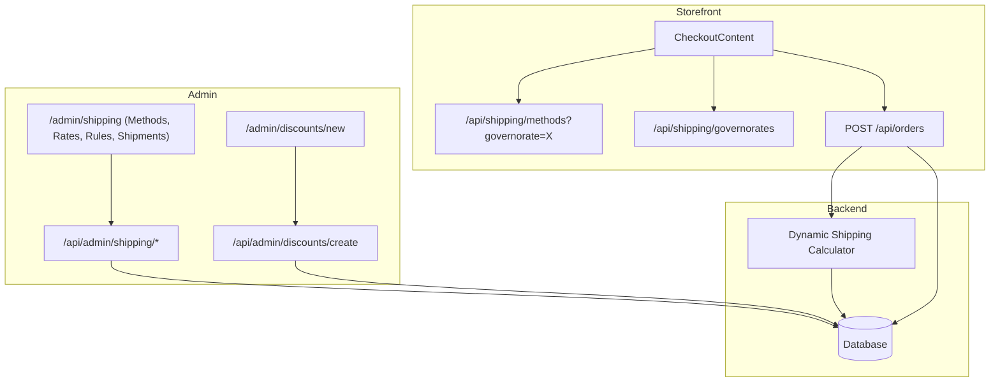

# Shipping Management System — Design Spec

## Overview

Add a comprehensive shipping management system to the admin panel, replacing the current hardcoded flat-rate shipping (E£15 / E£250 threshold). The system covers: shipping methods/couriers, governorate-based pricing, free shipping rules, order shipping receipts/tracking, and shipping promo coupons.

---

## 1. Database Models

### Governorate
Predefined list of the 27 Egyptian governorates. Seeds on first deploy — not user-manageable.

| Field | Type | Notes |
|-------|------|-------|
| id | String @id | cuid |
| name | String | e.g. "Cairo", "Alexandria", "Giza" |
| nameAr | String | Arabic name |

### ShippingMethod (courier company)

| Field | Type | Notes |
|-------|------|-------|
| id | String @id | cuid |
| name | String | Company name (e.g. "Aramex", "DHL") |
| estimatedDays | String | e.g. "1–3 business days" |
| isActive | Boolean | Toggle to enable/disable |
| createdAt | DateTime | auto |

### ShippingRate (price per governorate per method)

| Field | Type | Notes |
|-------|------|-------|
| id | String @id | cuid |
| methodId | String | FK → ShippingMethod |
| governorateId | String | FK → Governorate |
| price | Float | Shipping cost for this method to this governorate |
| Unique | [methodId, governorateId] | One rate per pair |

If no rate exists for a method+governorate, that method is unavailable for that location.

### ShippingRule (automatic free/discounted shipping conditions)

| Field | Type | Notes |
|-------|------|-------|
| id | String @id | cuid |
| name | String | Internal label |
| methodId | String? | Null = applies to all methods |
| minAmount | Float? | Minimum order subtotal to qualify |
| governorateId | String? | Null = all governorates |
| discountType | String | `free` / `percentage` / `fixed` — what kind of shipping discount |
| discountValue | Float? | If percentage: 0–100; if fixed: amount off; if free: ignored |
| isActive | Boolean | |
| startDate | DateTime? | Null = always active |
| endDate | DateTime? | Null = no end |
| createdAt | DateTime | auto |

ShippingRules are automatic — no coupon code required. They apply when order conditions match.

### Shipment (tracking record per order)

| Field | Type | Notes |
|-------|------|-------|
| id | String @id | cuid |
| orderId | String | FK → Order (unique — one shipment per order) |
| methodId | String | FK → ShippingMethod |
| trackingNumber | String | |
| status | String | `pending` / `shipped` / `delivered` / `failed` |
| shippedAt | DateTime? | |
| estimatedDeliveryAt | DateTime? | |
| deliveredAt | DateTime? | |
| addressSnapshot | String | JSON snapshot of delivery address at time of shipment |
| notes | String? | |
| createdAt | DateTime | auto |
| updatedAt | DateTime | auto |

### Discount (enhanced)

Additions to the existing Discount model:

| Field | Type | Notes |
|-------|------|-------|
| type | String | Add `SHIPPING` to existing `PERCENTAGE` / `FIXED` |
| governorateId | String? | FK → Governorate. Null = all locations. |

For `type: 'SHIPPING'`:
- `value = 0` → free shipping
- `value = 50` → 50% off shipping cost
- `appliesTo` and `targetValue` are ignored (no product scoping for shipping promos)
- `minOrder` still applies (minimum cart total)

---

## 2. Admin UI Pages

### `/admin/shipping` — New dedicated shipping page with tabs

**Tab 1: Methods**
- Table of courier companies with name, estimated days, active toggle
- Add new method form (inline or modal)
- Edit/delete existing methods

**Tab 2: Rates**
- Matrix grid: rows = governorates (all 27), columns = shipping methods
- Each cell is a number input for the price
- Empty cell = method not available for that governorate
- Bulk save button

**Tab 3: Free Shipping Rules**
- List of automatic rules with name, method, amount, governorate, dates, active toggle
- Add/edit rule form (modal): name, method dropdown, min amount, governorate dropdown (or all), discount type + value, date range, active toggle

**Tab 4: Shipments**
- List of confirmed orders NOT yet shipped (no shipment record yet)
- Each row: order number, customer name, delivery address, total, date
- Click → create shipment modal:
  - Auto-fills: order info (number, items, customer, address)
  - Manual fields: select shipping method, enter tracking number, set shipped date, estimated delivery date, notes
  - Save creates the Shipment record + updates order status to "shipped"
- Also shows completed shipments with filtering/search

### `/admin/discounts/new` — Enhanced discount creation

- Type dropdown gains a third option: **"Shipping Promo"**
- When type = SHIPPING:
  - Sub-type: "Free Shipping" / "Percentage off Shipping" / "Fixed amount off Shipping"
  - Value input (for percentage or fixed amount; hidden for free shipping)
  - Governorate dropdown (optional — restricts coupon to delivery addresses in this governorate)
  - `appliesTo` / `targetValue` fields hidden
  - Existing fields work: coupon code, minimum order, max uses, expiration date, active toggle

---

## 3. Storefront / Checkout Integration

### Shipping cost calculation (replaces hardcoded E£15 / E£250)

At checkout, when the customer selects a delivery address:

1. **Determine governorate** from the delivery address `city` field → match to Governorate list
2. **Get available methods** — only methods that have a ShippingRate for this governorate
3. **Customer selects a method** (or default to cheapest)
4. **Calculate base cost** = ShippingRate.price for selected method + governorate
5. **Apply any matching ShippingRules** — automatic free/discounted shipping:
   - Must match: method (or all), minAmount ≤ subtotal, governorate (or all), current date within range (if set)
   - If multiple rules match, apply the best one (most savings)
6. **Apply coupon** if customer entered a SHIPPING-type discount code:
   - Validate: coupon is active, not expired, usage limit not reached
   - If coupon has a governorate restriction, check delivery governorate matches → reject with message if not
   - Apply: free (set shipping to 0) / percentage off / fixed amount off
   - Coupon overrides automatic ShippingRules (the coupon result replaces any auto rule discount)
7. **Display final shipping cost** in order summary

### Order creation API (`/api/orders`)

- Replace hardcoded `shipping = subtotal >= 250 ? 0 : 15` with the dynamic calculation above
- Store the selected `shippingMethodId` on the Order (add field)
- Store the `shipping` cost as calculated
- Store the delivery governorate

### POS checkout

- POS sales remain in-store with `shipping: 0` — no changes needed

---

## 4. Governorate Seed Data

The 27 Egyptian governorates to seed:

1. Cairo
2. Alexandria
3. Giza
4. Qalyubia
5. Port Said
6. Suez
7. Damietta
8. Dakahlia
9. Sharqia
10. Gharbia
11. Monufia
12. Beheira
13. Kafr El Sheikh
14. Minya
15. Asyut
16. Sohag
17. Qena
18. Luxor
19. Aswan
20. Red Sea
21. New Valley
22. Matrouh
23. North Sinai
24. South Sinai
25. Beni Suef
26. Fayoum
27. Ismailia

---

## 5. API Routes

### New endpoints

| Route | Method | Purpose |
|-------|--------|---------|
| `/api/admin/shipping/methods` | GET/POST | List / create shipping methods |
| `/api/admin/shipping/methods/[id]` | PUT/DELETE | Update / delete method |
| `/api/admin/shipping/rates` | GET/PUT | Get / bulk-save rate matrix |
| `/api/admin/shipping/rules` | GET/POST | List / create free shipping rules |
| `/api/admin/shipping/rules/[id]` | PUT/DELETE | Update / delete rule |
| `/api/admin/shipping/shipments` | GET | List orders awaiting / with shipments |
| `/api/admin/shipping/shipments/create` | POST | Create shipment record + update order status |
| `/api/shipping/governorates` | GET | Public list of governorates (for checkout) |
| `/api/shipping/methods` | GET | Public available methods for a governorate (for checkout) |

### Modified endpoints

| Route | Change |
|-------|--------|
| `PUT /api/admin/discounts/create` | Accept `governorateId` and shipping-specific fields |
| `POST /api/orders` | Use dynamic shipping cost calculation |
| `POST /api/chat` | No change (admin only, but could reference new models) |

---

## 6. Dependencies & Data Flow

---

## 7. Edge Cases & Notes

- **No rate for governorate**: If a method has no rate for a governorate, it simply doesn't appear as an option for that address. If no methods are available at all, show "Shipping not available to this address" and block checkout.
- **Multiple matching rules**: Apply the one that gives the biggest discount. If equal, apply the most recently created.
- **Coupon + auto rule conflict**: Coupon takes precedence (overrides auto rule). Auto rule only applies if no coupon is used.
- **Address doesn't match a known governorate**: Try fuzzy match on `city` field. If nothing matches, show "Shipping not available to your address" and require the customer to select a different address.
- **Shipment already exists**: Error — one shipment per order. Allow editing existing shipment instead.
- **Partially shipped orders**: Not in scope for v1. Each order gets one shipment.
- **Order status flow**: `confirmed` → create shipment → status becomes `shipped` → `delivered` when shipment marked delivered.
- **POS orders**: No shipping needed. Skip shipment creation.
